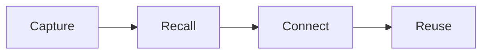

> Give your AI the knowledge you already have.

Start with your first memory and gradually build a knowledge layer for your AI.

## Browse the tutorial

On mobile, the top tab bar may be hidden. The entries below get you to the same sections.

<CardGroup cols={3}>
  <Card title="Essentials" icon="book-open" href="/essentials">
    Start with your first memory and close Mem's most basic loop.

    Beginner · 6 lessons · ~25 min
  </Card>

  <Card title="AI Workflow" icon="workflow" href="/ai-workflow">
    Let different AI tools share the same context.

    Intermediate · 4 lessons · ~20 min
  </Card>

  <Card title="AI Now" icon="sparkles" href="/ai-now">
    Learn an analysis workflow through five guided simulations: find context, read sources, check evidence, and save the result.

    Intermediate · 5 lessons · ~25 min
  </Card>

</CardGroup>

## From the community

Articles, posts, and sites where people share how they build their own knowledge map with Nowledge Mem. Browse [all community entries](/community), or open one here to read the original.

<CardGroup cols={3}>
  <Card title="Stop making agents start over: build a shared memory hub with Nowledge Mem" icon="external-link" href="https://x.com/guoxudong_/status/2092604004245332474">
    Xudong Guo shares how a Mac mini serves as a memory hub for a MacBook, a Linux server, a phone, and connected agents.

    X article · Chinese · Read the original ↗
  </Card>

  <Card title="What should a memory product look like in the agent era?" icon="external-link" href="https://x.com/hbyxabc/status/2093326775862599708">
    HB lists five capabilities a mature memory product needs, from local-first sync to standard export.

    X article · Chinese · Read the original ↗
  </Card>

  <Card title="Project memory for AI, seen by the world's first user" icon="external-link" href="https://x.com/HaraAmami/status/2091523661077561348">
    Amami Hara on cross-tool project memory that ends repeated context re-explaining.

    X article · Japanese · Read the original ↗
  </Card>

</CardGroup>

## What this is

Nowledge Mem is your long-term knowledge layer. Anything you leave behind can later be searched, linked to other knowledge, and reused by the AI tools connected to Mem.

**Who it's for:** People who use AI tools every day but don't want to re-explain the same background again and again.

**What's different:**

- **Cross-tool**: Codex, Claude Code, Cursor, and other AIs share the same context
- **Hands-on**: The tutorial is built around real exercises, starting from your first memory
- **Progressive**: From Essentials to a knowledge system, pick the path that fits your goals

## How it works



Leave knowledge first. Bring it back when you need it. Then let the AI connected to Mem use it.

## Try it in 3 minutes

Experience your first Capture → Recall loop in about 3 minutes:

<Steps>
  <Step title="Open Nowledge Mem and go to Timeline">
    Type something real that's worth keeping.

    ```text
    We decided the new marketing site uses Next.js because we need SSR and better SEO.
    ```
  </Step>
  <Step title="Press Enter to save">
    The content appears in Timeline. Your first memory is saved.
  </Step>
  <Step title="Ask Mem directly">
    Don't scroll through your notes. Ask in Timeline:

    ```text
    What technology did we decide on for the new site?
    ```

    Mem finds the memory and answers you.
  </Step>
</Steps>

By completing these steps, you've gone through Mem's most basic loop. For the details, see [Lesson 1](/essentials/first-memory) and [Lesson 2](/essentials/recall-memory).

## Start here

<CardGroup cols={3}>
  <Card title="Essentials course" icon="graduation-cap" href="/essentials">
    6 lessons build a complete Capture → Recall loop in about 25 minutes.
  </Card>

  <Card title="Mem official docs" icon="book" href="https://mem.nowledge.co/docs">
    Full documentation for features like Memory and Timeline.
  </Card>

</CardGroup>
