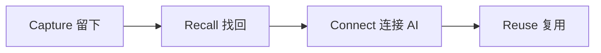

> 让你的 AI，用上你已经知道的东西。

从第一条记忆开始，逐渐建立属于你的 AI 知识层。

## 浏览教程

移动端可能看不到完整的顶部标签栏，下面的入口同样可以到达各个板块。

<CardGroup cols={3}>
  <Card title="Essentials" icon="book-open" href="/zh/essentials">
    从第一条记忆开始，建立 Mem 最基本的使用闭环。

    入门 · 6 课 · 约 25 分钟
  </Card>

  <Card title="AI Workflow" icon="workflow" href="/zh/ai-workflow">
    让不同 AI 工具共享同一份上下文。

    进阶 · 4 课 · 约 20 分钟
  </Card>

  <Card title="AI Now" icon="sparkles" href="/zh/ai-now">
    通过五课模拟交互，练习找回上下文、阅读来源、核查证据和保存结果。

    进阶 · 5 课 · 约 25 分钟
  </Card>

</CardGroup>

## 来自社区

大家分享如何用 Nowledge Mem 搭建自己知识地图的文章、帖子和网站。打开[社区索引](/zh/community)浏览全部条目，或直接点击下方条目阅读原文。

<CardGroup cols={3}>
  <Card title="让 Agent 不再从头开始：用 Nowledge Mem 搭建统一记忆中枢" icon="external-link" href="https://x.com/guoxudong_/status/2092604004245332474">
    Xudong Guo 分享如何把 Mac mini 作为记忆中枢，让 MacBook、Linux 服务器、手机和接入的 Agent 使用同一份长期记忆。

    X 文章 · 中文 · 阅读原文 ↗
  </Card>

  <Card title="Agent 时代，用户需要怎样的记忆产品？" icon="external-link" href="https://x.com/hbyxabc/status/2093326775862599708">
    HB 列出成熟记忆产品的五项能力，从本地优先同步到标准化导出。

    X 文章 · 中文 · 阅读原文 ↗
  </Card>

  <Card title="世界首位用户眼中的 AI 项目记忆" icon="external-link" href="https://x.com/HaraAmami/status/2091523661077561348">
    Amami Hara 讲述跨工具的项目记忆如何让背景不再反复重述。

    X 文章 · 日文 · 阅读原文 ↗
  </Card>

</CardGroup>

## 这是什么

Nowledge Mem 是你的长期知识层。你留下的每一条信息，之后都可以被重新搜索、和其他知识产生关联，并被连接到 Mem 的 AI 工具再次使用。

**适合谁：** 每天使用 AI 工具，却不想反复解释同一份背景的人。

**有什么不同：**

- **跨工具**：Codex、Claude Code、Cursor 等 AI 共享同一份上下文
- **可操作**：教程以真实练习为主，从第一条记忆开始建立完整闭环
- **渐进式**：从 Essentials 到知识系统，按目标选择路线

## 如何运作



先留下知识，需要时直接把它找回来，再让连接 Mem 的 AI 使用它。

## 快速体验

3 分钟体验第一个 Capture → Recall 闭环：

<Steps>
  <Step title="打开 Nowledge Mem，进入 Timeline">
    在输入框中写下一件真实、值得留下的事情。

    ```text
    我们决定新版官网使用 Next.js，因为需要 SSR 和更好的 SEO。
    ```
  </Step>
  <Step title="按 Enter 保存">
    内容出现在 Timeline 中，第一条记忆就留下了。
  </Step>
  <Step title="直接问 Mem">
    不要翻记录，在 Timeline 中提问：

    ```text
    新版官网之前决定使用什么技术？
    ```

    Mem 会找到刚才的记忆并回答你。
  </Step>
</Steps>

完成上面的步骤，你已经走通了 Mem 最基本的闭环。详细讲解见[第一课](/zh/essentials/first-memory)和[第二课](/zh/essentials/recall-memory)。

## 从这里开始

<CardGroup cols={3}>
  <Card title="Essentials 课程" icon="graduation-cap" href="/zh/essentials">
    6 节课建立完整的 Capture → Recall 闭环，约 25 分钟。
  </Card>

  <Card title="Mem 官方文档" icon="book" href="https://mem.nowledge.co/zh/docs">
    了解 Memory、Timeline 等功能的完整说明。
  </Card>

</CardGroup>
